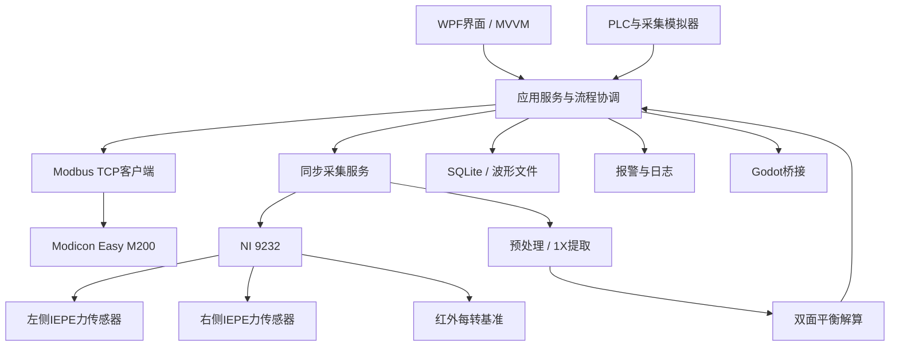
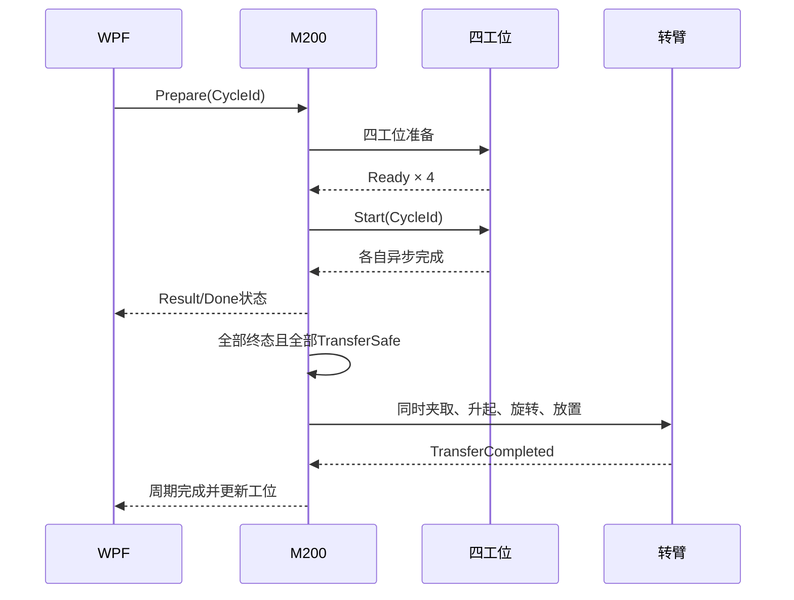

# Digital-Twin-A4WZ2 四工位卧式钻孔动平衡机上位机系统方案

| 项目 | 内容 |
| --- | --- |
| 文档版本 | V0.2 |
| 文档状态 | 待评审 |
| 目标平台 | Windows x64、.NET 10、WPF |
| PLC | Schneider Electric Modicon Easy M200（暂按 TM200CE40T） |
| PLC协议 | Modbus TCP |
| 数字孪生 | Godot 4.6 C#，作为独立显示模块 |
| 编制日期 | 2026-07-31 |

## 1. 建设目标

本项目建设一套用于四工位卧式钻孔动平衡机的工业上位机。系统负责设备操作、四工位状态展示、配方管理、双面动平衡测量、钻孔修正计算、生产追溯、报警、日志、设置和数字孪生展示。

真实设备动作和安全联锁由PLC负责。WPF负责生产流程管理、数据采集、算法计算、数据持久化和人机交互。Godot只展示设备与工件状态，不直接控制真实设备。

系统必须同时支持真实硬件和模拟硬件。没有PLC或采集卡时，模拟器应能够驱动完整自动流程，方便软件开发、教学和Demo联调。

## 2. 已确认的业务条件

1. 设备包含四个工位，四个工位在同一个生产节拍内同时开始工作。
2. 四个工位不要求同时结束，先完成的工位保持等待。
3. 四个工位全部发出准备完成信号后，才允许本周期同时启动。
4. 四个工位全部进入加工终态，并全部达到转位安全状态后，机械手才允许同时夹取、旋转和放置。
5. 无料、测量失败和钻孔失败都允许物理转位，但必须保留不同的业务结果。
6. 测量失败的工件不允许使用无效测量结果执行钻孔。
7. 工件初次测量失败后最多重新测量两次，即总测量次数最多三次；第三次仍失败则判废。
8. 自动、手动、单步、调试和维修模式提供全部动作能力，但任何模式均不能绕过安全联锁。
9. 合格标准、测量参数和钻孔修正参数由授权人员通过配方设置。
10. 动平衡采用双面平衡，采集两路压电动态力信号和一路每转基准信号。
11. 当前阶段没有PLC、压电传感器、A/D采集卡和红外传感器，首期开发必须完全支持模拟数据调试。

## 3. 系统边界与职责

### 3.1 PLC职责

- 执行主轴、夹具、转臂、探头和钻孔机构的实时顺序控制。
- 采集现场数字量、模拟量和安全状态。
- 实现主轴停止、探头抬起、钻头退出、夹紧确认等动作互锁。
- 维护四工位准备、加工、完成和转位安全状态。
- 在上位机离线时进入已定义的安全等待状态。
- 执行上位机下发且通过PLC联锁校验的命令。

### 3.2 WPF上位机职责

- 登录、权限、导航和界面交互。
- 自动、手动、单步、调试和维修操作。
- Modbus TCP通信、命令确认、心跳和重连。
- A/D同步采集、信号预处理和双面平衡计算。
- 配方、标定、生产结果、报警和日志管理。
- 工件身份、工位位置、测量次数和质量状态跟踪。
- 将计算出的修正量、钻孔角度和深度发送给PLC。
- 向Godot发送设备与工件状态。

### 3.3 Godot职责

- 展示四工位、机械手、夹具、转子、测速模块和钻孔机构的运行状态。
- 按WPF状态快照播放动画。
- 支持独立窗口或嵌入WPF页面显示。
- 不直接访问PLC，不作为真实设备状态源。

### 3.4 安全边界

急停、安全门、主轴超速和危险动作互锁不得依赖WPF或Godot。安全逻辑必须由安全回路与PLC执行。上位机只负责显示、记录、提示和发送受PLC联锁约束的动作请求。

## 4. 总体架构



系统采用分层、接口驱动和依赖注入设计。设备驱动不允许直接操作WPF控件，ViewModel不允许直接读写PLC寄存器或采集卡。

## 5. 软件解决方案结构

计划创建独立的Visual Studio解决方案：

```text
DigitalTwinA4WZ2.sln
├─ src/
│  ├─ DigitalTwinA4WZ2.Hmi
│  ├─ DigitalTwinA4WZ2.Domain
│  ├─ DigitalTwinA4WZ2.Application
│  ├─ DigitalTwinA4WZ2.Infrastructure
│  ├─ DigitalTwinA4WZ2.Plc.Modbus
│  ├─ DigitalTwinA4WZ2.Acquisition
│  ├─ DigitalTwinA4WZ2.SignalProcessing
│  ├─ DigitalTwinA4WZ2.DigitalTwinBridge
│  └─ DigitalTwinA4WZ2.Simulator
└─ tests/
   ├─ DigitalTwinA4WZ2.Domain.Tests
   ├─ DigitalTwinA4WZ2.Application.Tests
   ├─ DigitalTwinA4WZ2.SignalProcessing.Tests
   └─ DigitalTwinA4WZ2.IntegrationTests
```

### 5.1 项目职责

| 项目 | 职责 |
| --- | --- |
| Hmi | XAML、窗口、页面、ViewModel、对话框 |
| Domain | 工件、工位、配方、测量结果、报警等领域模型 |
| Application | 状态机、用例、命令调度、业务规则 |
| Infrastructure | 数据库、文件、配置、结构化日志 |
| Plc.Modbus | M200连接、寄存器编解码、命令握手 |
| Acquisition | 采集卡接口、NI驱动适配器、采样缓冲 |
| SignalProcessing | 滤波、转速、相位、1X与双面平衡算法 |
| DigitalTwinBridge | Godot进程和IPC通信 |
| Simulator | 模拟PLC、模拟采集卡、故障注入 |

### 5.2 技术规则

- WPF目标框架为`net10.0-windows`。
- 使用MVVM和数据绑定，不在代码隐藏中实现业务流程。
- 使用Generic Host管理依赖注入、配置、日志和后台服务。
- 高频采样数据通过有界队列传递，禁止无限缓存。
- UI只接收降频后的状态快照，建议刷新频率10～20 Hz。
- 所有公共类、接口、枚举、属性和方法使用中文XML注释。
- 注释重点解释业务原因、单位、边界条件和状态转换，不重复代码表面含义。
- 单位必须写入名称或元数据，不允许依赖隐含单位。

### 5.3 硬件配置切换

系统定义三个互斥的硬件配置：

```text
Simulation：完全使用模拟PLC和模拟采集数据
Replay：回放已经保存的真实或标准波形
Real：连接真实M200和NI采集卡
```

配置在应用启动前确定，运行中不得从模拟模式直接切换到真实模式。所有界面顶部必须明显显示当前硬件配置，模拟数据不得写入正式生产统计。

应用层只依赖以下接口：

```text
IPlcClient
IAcquisitionDevice
IMachineClock
IDigitalTwinBridge
IWaveformRepository
```

真实驱动和模拟驱动实现相同接口。接入物理设备时只替换依赖注入配置，不修改状态机、ViewModel、配方、算法和数据模型。

## 6. 模拟优先调试方案

### 6.1 模拟层级

系统提供三种互补的模拟方式：

| 模拟方式 | 用途 |
| --- | --- |
| 进程内模拟 | 单元测试和快速业务调试，不经过网络 |
| Modbus TCP模拟PLC | 验证真实协议、寄存器、超时和重连 |
| 波形生成/回放 | 验证采集、滤波、相位和双面平衡算法 |

进程内模拟使用虚拟时钟，可以确定性地快进，不依赖真实等待。Modbus TCP模拟PLC默认监听`127.0.0.1:1502`，避免与真实PLC端口502混淆。

### 6.2 虚拟M200

虚拟PLC实现与正式M200完全相同的寄存器点表和命令握手：

- 接收运行模式、配方、启动、停止、单步和手动命令。
- 独立模拟四个工位的准备时间和加工时间。
- 四工位同时开始，但按各自配置的时间结束。
- 全部终态且全部转位安全后执行模拟转臂流程。
- 递增PLC心跳、CycleId和命令确认序号。
- 支持网络断开、响应延迟、非法地址和命令拒绝。

模拟器不得复制另一套业务规则。四工位终态判断、返修次数和质量判定仍由共享领域模型负责，避免模拟流程与真实流程产生两套行为。

### 6.3 三通道模拟信号

模拟采集设备生成与NI 9232一致的数据块：

```text
通道0：左侧动态力
通道1：右侧动态力
通道2：红外每转基准脉冲
```

转角由转速积分得到：

```text
θ(t) = ∫ω(t)dt
ω(t) = 2πn(t) / 60
```

双面不平衡向量：

```text
U = [UA × e^(jφA), UB × e^(jφB)]ᵀ
```

左右测量通道的理论响应：

```text
V = H × U
F(t) = Re[V × e^(jθ(t))] + Noise + Harmonics + Drift
```

其中`H`为配方中的双面影响系数矩阵。模拟器先根据已知不平衡量生成两路波形，算法再从波形反算不平衡量，从而形成可验证闭环。

### 6.4 可配置的信号因素

- 初始转速、目标转速、升速时间和稳速时间。
- 转速波动、随机抖动和缓慢漂移。
- A/B面不平衡量和相位。
- 两个测量通道的灵敏度、增益和极性。
- 白噪声、工频干扰、直流漂移。
- 2X、3X等谐波。
- 红外脉冲宽度、延迟、丢脉冲和多脉冲。
- ADC量化、削顶和丢样。
- 随机种子。

每个模拟场景保存固定随机种子，相同输入必须生成相同输出，保证测试可以重复。

### 6.5 钻孔闭环模拟

钻孔完成后，模拟器根据上位机下发的校正向量更新工件真实不平衡量：

```text
U(k+1) = U(k) + C(command) + E(process)
```

其中`E(process)`表示角度误差、钻深误差、材料密度误差和刀具磨损。下一次复测使用更新后的真实不平衡量生成波形。

正常场景应逐次收敛；工艺误差过大时进入返修；初次测量加两次重测仍不合格时判废。

### 6.6 预置故障场景

| 场景 | 预期行为 |
| --- | --- |
| Normal | 完整测量、钻孔、复测并合格 |
| EmptyStation | 空工位不加工但不阻塞转位 |
| MeasurementFailed | 测量失败、跳过钻孔并进入重测 |
| DrillingFailed | 保留钻孔失败，允许转位和诊断复测 |
| SensorOpen | IEPE开路报警，测量无效 |
| SignalSaturation | 波形削顶报警，禁止使用结果 |
| TachLost | 红外脉冲丢失，停止当前测量 |
| SpeedUnstable | 转速不稳，等待或超时失败 |
| PlcDisconnected | 上位机离线、禁止新命令并自动重连 |
| CommandTimeout | 命令未确认，不允许自动重复执行 |
| InvalidCalibration | 影响系数不可用，禁止生产计算 |
| DiskSpaceLow | 原始波形归档报警 |

### 6.7 模拟控制面板

调试页面提供：

- 场景选择。
- 随机种子。
- 时间倍率：0.25、1、2、5、10倍。
- 四工位准备与加工时长。
- 工件有无、初始不平衡量和相位。
- 噪声、谐波和转速波动。
- 故障发生周期、工位和持续时间。
- 单次注入、周期注入和清除故障。
- 当前模拟真值与算法计算值对比。

模拟真值只在调试权限下显示，正常操作页面只能看到与真实设备一致的测量结果。

### 6.8 模拟数据隔离

- 模拟记录使用独立数据库或独立数据库标识。
- 所有模拟结果带`IsSimulated=true`。
- 报表和生产统计默认排除模拟数据。
- 模拟模式使用明显颜色和水印。
- 模拟PLC不能绑定真实PLC的IP地址。
- 真实模式启动前必须关闭模拟服务器。

## 7. 四工位并行控制模型

暂定逻辑工位如下，实际物理位置与旋转方向通过配置映射：

| 工位 | 暂定职责 |
| --- | --- |
| 工位1 | 上料、下料和工件识别 |
| 工位2 | 初次动平衡测量 |
| 工位3 | 钻孔去重 |
| 工位4 | 复测、判定和返修决策 |

### 7.1 整机状态

```text
PowerOff
Initializing
Idle
Preparing
RunningStations
WaitingForStations
PreparingTransfer
Transferring
CompletingCycle
Stopping
Faulted
EmergencyStopped
```

### 7.2 工位状态

```text
Empty
Preparing
Ready
Processing
Completed
Bypassed
Failed
TransferSafe
```

### 7.3 工位结果

```text
None
Success
NoMaterial
MeasurementFailed
DrillingFailed
Scrapped
Cancelled
Faulted
```

`Done`只表示本周期已经结束，不表示成功。`Success`、`NoMaterial`、`MeasurementFailed`、`DrillingFailed`、`Scrapped`和`Cancelled`均属于终态。

### 7.4 屏障条件

```text
允许启动 =
    四工位全部Ready
    且整机无阻断报警
    且安全条件满足

允许转位 =
    四工位全部进入终态
    且四工位全部TransferSafe
    且主轴已停止
    且探头已抬起
    且钻头已退出
    且夹具处于交接状态
    且转臂无故障
```

### 7.5 周期时序



周期编号`CycleId`用于隔离前后两次生产周期。PLC和WPF都不得仅根据持续为真的`Done`位重复执行动作。

## 8. 工件追踪与返修

每个工件具有稳定身份，状态随转位移动：

```text
WorkpieceId
Barcode
RecipeId
CurrentStation
SlotIndex
MeasurementAttemptCount
InitialMeasurement
LatestMeasurement
DrillingHistory
QualityStatus
FailureCode
```

### 8.1 测量失败

- 允许物理转位。
- 标记`MeasurementFailed`或`ReworkPending`。
- 没有有效双面测量结果时，钻孔工位必须跳过。
- 到达兼容测量工位后重新测量。
- 初次测量加两次重测，总次数最多三次。
- 第三次仍失败则标记`Scrapped`并在上下料工位排出。

### 8.2 钻孔失败

- 允许物理转位。
- 保留`DrillingFailed`，不得被普通测量结果自动覆盖。
- 后续复测可用于诊断残余不平衡量。
- 是否允许工程师改判必须记录审核人与原因。

### 8.3 无料

无料工位返回：

```text
Ready = true
Done = true
ResultCode = NoMaterial
TransferSafe = true
```

空工位不得阻塞整机屏障。

## 9. 运行模式

| 模式 | 运行方式 |
| --- | --- |
| 自动 | 执行完整生产循环 |
| 手动 | 独立控制允许的轴、夹具、主轴、探头和钻孔动作 |
| 单步 | 每次确认只执行一个状态转换 |
| 调试 | 允许模拟I/O、模拟波形、断点和故障注入 |
| 维修 | 回零、点动、标定、传感器检查和部件测试 |

所有模式均可提供动作入口，但自动运行期间拒绝冲突的手动命令。急停、安全门、主轴未停、钻头未退和探头未抬起等联锁始终生效。

## 10. 测量硬件方案

### 10.1 传感器

- 左右测量支撑各使用一只PCB Piezotronics 208C03 ICP/IEPE动态力传感器。
- 量程：±2.224 kN。
- 灵敏度：约2.248 mV/N。
- IEPE激励：2～20 mA。
- 安装在真实力传递路径中并保持固定预紧力。

量程最终依据`F = U × ω²`校核。正常最大动态力建议位于量程的20%～80%。

### 10.2 A/D采集

- NI 9232 BNC，三通道同步、24位、最高102.4 kS/s/通道。
- AI0：左侧力传感器，AC耦合，开启IEPE。
- AI1：右侧力传感器，AC耦合，开启IEPE。
- AI2：红外基准脉冲，DC耦合，关闭IEPE。
- 采集机箱暂选cDAQ-9174；预算受限且无需扩展时可改为cDAQ-9171。

### 10.3 红外基准

- OMRON EE-SX770A槽型红外传感器。
- 使用单缺口测速盘或每转一次的触发片。
- 输出经24V上拉、施密特整形和隔离分配。
- 一路送NI 9232获得同步相位，一路送M200高速输入用于安全监控。
- 使用固定边沿定义零度，安装角度误差写入配方补偿。
- 传感器安装在遮光罩内，防止环境光干扰。

### 10.4 NI驱动边界

WPF保持.NET 10。NI-DAQmx封装在独立适配器中，优先验证厂商.NET程序集；如兼容性不足，则通过NI-DAQmx ANSI C接口和P/Invoke调用。应用层只依赖`IAcquisitionDevice`，不得依赖NI专有类型。

## 11. 信号处理与双面平衡算法

### 11.1 采集质量门控

- 等待主轴进入目标转速范围。
- 检查转速波动是否小于配方限值。
- 检查每转基准脉冲数量和间隔。
- 检查IEPE开路、短路、偏置异常和通道饱和。
- 采集达到最少有效转数后才允许计算。

### 11.2 预处理流程

1. 读取三路同步采样块。
2. 转换工程单位并去除异常点。
3. 对力信号执行高通、低通或带通滤波。
4. 根据基准脉冲计算瞬时转速与转角。
5. 将时间域信号重采样到等角度域。
6. 提取左右通道转频`1X`复数幅值。
7. 对多转结果进行矢量平均。
8. 计算幅值、相位、相位离散度和信噪指标。

### 11.3 双面影响系数

测量向量：

```text
V = [A1 × e^(jφ1), A2 × e^(jφ2)]ᵀ
```

标定得到影响系数矩阵：

```text
H = [H11 H12
     H21 H22]
```

两个校正面的校正向量：

```text
C = -H⁻¹ × V
```

系统必须检查矩阵是否病态、标定版本是否匹配当前配方以及相位方向是否一致。

### 11.4 标定向导

1. 空试重完成基础测量。
2. 在校正面A指定角度安装已知试重并测量。
3. 移除A面试重。
4. 在校正面B安装已知试重并测量。
5. 计算影响系数矩阵。
6. 使用标准转子验证。
7. 工程师审核后发布标定版本。

生产配方只能引用已发布的标定版本。

## 12. 钻孔修正

概念换算关系：

```text
去除质量 m = 不平衡量 U / 修正半径 r
去除体积 V = m / 材料密度 ρ
理论孔深 h = V / [π × (钻头直径 d)² / 4]
实际孔深 = 理论孔深 × 工艺标定系数 + 刀具补偿
```

实际执行还必须满足：

- 单孔最大深度。
- 单次最大去重量。
- 每个校正面的最大孔数。
- 禁止钻孔区域。
- 相邻孔最小角度。
- 钻孔角度分辨率。
- 材料和刀具补偿。
- 超出单孔能力时的分孔策略。
- 钻孔角度零位与红外零位的安装补偿。

超出工艺能力时，上位机不得截断后继续加工，而应产生“修正量超范围”报警。

## 13. 配方设计

### 13.1 基础信息

- 配方编号、名称、转子型号和版本。
- 转子质量、最大工作转速和旋转方向。
- 校正面A/B位置和修正半径。
- 创建人、审核人、发布时间和启用状态。

### 13.2 测量参数

- 测量转速和允许偏差。
- 稳速等待时间。
- 采样率、采样时长和最少有效转数。
- 滤波频率、平均次数和质量阈值。
- 两个传感器灵敏度、增益、极性和单位。
- 红外每转脉冲数和零度补偿。
- 双面标定版本。

### 13.3 合格标准

- A面允许残余不平衡量。
- B面允许残余不平衡量。
- 总残余不平衡量。
- 最大相位离散度。
- 最大重复测量偏差。
- 最大返修次数，默认两次。
- 可选平衡品质等级。

### 13.4 钻孔参数

- 材料密度。
- 钻头直径。
- 最小/最大钻深。
- 单孔去重量和每面最大孔数。
- 允许与禁止角度区域。
- 工艺标定系数和刀具磨损补偿。

### 13.5 权限与版本

- 操作员只能选择已发布配方。
- 工程师可以复制和编辑草稿配方。
- 管理员配置硬件保护上下限。
- 已用于生产的配方不可直接修改，只能创建新版本。
- 所有参数修改记录修改前值、修改后值、人员、时间和原因。

## 14. PLC通信方案

### 14.1 连接参数

| 参数 | 初始值 |
| --- | --- |
| PLC IP | 192.168.1.10 |
| 上位机 IP | 192.168.1.20 |
| 端口 | 502 |
| Unit ID | 可配置，联调初值255 |
| 状态轮询 | 100 ms |
| 连接超时 | 1500 ms |
| 单次读写超时 | 500 ms |
| 心跳周期 | 1000 ms |
| 掉线判定 | 连续3次失败 |
| 重连退避 | 1、2、5、10秒 |

上位机一次读取连续寄存器块，避免大量零散请求。命令采用“命令序号—PLC确认序号”握手，断线重连后禁止自动重放旧命令。

### 14.2 地址约定

施耐德`%MW0`对应传统Modbus地址`400001`。软件内部统一使用零基地址`0`，通信文档同时显示PLC地址和上位机地址。

### 14.3 状态区

| PLC地址 | 零基地址 | 内容 |
| --- | ---: | --- |
| %MW0 | 0 | 协议版本 |
| %MW1 | 1 | PLC心跳 |
| %MW2 | 2 | 当前CycleId |
| %MW3 | 3 | 运行模式 |
| %MW4 | 4 | 整机状态 |
| %MW5 | 5 | 整机状态位 |
| %MW6 | 6 | 当前报警代码 |
| %MW7 | 7 | 当前配方编号 |
| %MW8 | 8 | 已接受命令序号 |
| %MW9 | 9 | 命令执行结果 |

工位状态块：

```text
工位1：%MW20～%MW31
工位2：%MW32～%MW43
工位3：%MW44～%MW55
工位4：%MW56～%MW67
```

每个工位块：

| 偏移 | 内容 |
| ---: | --- |
| +0 | 状态位 |
| +1 | 工位状态 |
| +2 | 结果代码 |
| +3 | 故障代码 |
| +4～5 | 工件编号 |
| +6 | 测量尝试次数 |
| +7 | 加工进度，0～1000 |
| +8～9 | 加工时间 |
| +10～11 | 预留 |

状态位：

```text
Bit 0：有工件
Bit 1：准备完成
Bit 2：正在加工
Bit 3：加工完成
Bit 4：允许转位
Bit 5：工位故障
Bit 6：工件合格
Bit 7：工件报废
Bit 8：跳过加工
```

### 14.4 命令区

| PLC地址 | 内容 |
| --- | --- |
| %MW100 | WPF心跳 |
| %MW101 | 命令序号 |
| %MW102 | 请求模式 |
| %MW103 | 命令代码 |
| %MW104 | 目标工位掩码 |
| %MW105 | CycleId |
| %MW106 | 配方编号 |
| %MW107～%MW111 | 命令参数 |
| %MW112～%MW127 | 预留 |

### 14.5 测量结果区

测量结果使用缩放整数，避免浮点字节序歧义：

```text
相位 12345 = 123.45°
不平衡量 8250 = 8.250 g·mm
钻孔深度 1520 = 1.520 mm
转速 1800 = 1800 rpm
```

原始波形不得通过Modbus传输。

## 15. 数据存储

### 15.1 SQLite结构化数据

- 用户、角色和权限。
- 配方及版本。
- 标定记录。
- 工件和生产批次。
- 每次测量结果。
- 钻孔记录。
- 当前与历史报警。
- 操作审计。

### 15.2 波形文件

- 原始波形独立保存，数据库只保存路径、大小和哈希。
- 每个文件包含通道、采样率、量程、单位、开始时间和CycleId。
- 根据配置执行保留、压缩和清理。
- 磁盘空间低于阈值时报警并停止新的原始波形归档，不能静默删除质量记录。

### 15.3 追溯字段

- 工件编号、条码和批次。
- 操作员和设备编号。
- 配方、算法和标定版本。
- 初测、钻孔、复测和返修记录。
- 最终判定与失败原因。
- 原始波形引用。

## 16. UI功能

### 16.1 页面

- 登录页。
- 生产总览。
- 四工位详情。
- 自动运行。
- 手动操作。
- 单步调试。
- 实时波形、转速、频谱和相位极坐标。
- 双面修正和钻孔指导。
- 配方管理。
- 标定向导。
- 当前报警和历史报警。
- 生产记录和趋势。
- 通信、I/O和采集诊断。
- 系统设置。
- 用户和权限。
- 数字孪生。

### 16.2 数据绑定

- ViewModel向界面公开可观察属性和命令。
- PLC和采集线程发布不可变状态快照。
- 原始采样不直接绑定到控件。
- 波形显示按固定帧率抽取，存储仍保留完整数据。
- 所有输入字段显示单位、范围和验证信息。

## 17. 报警、异常和日志

### 17.1 区分

- 异常：程序内部技术错误。
- 日志：启动、通信、流程和诊断记录。
- 报警：需要操作员确认或阻止流程的问题。
- 审计：人员对配方、设置、报警和结果的操作记录。

### 17.2 报警等级

```text
Info
Warning
Fault
Emergency
```

### 17.3 报警字段

```text
AlarmCode
Severity
Source
StationId
WorkpieceId
RaisedAt
Message
Snapshot
IsLatched
AcknowledgedBy
AcknowledgedAt
ClearedAt
```

### 17.4 报警编号段

```text
1000～1999：PLC与运动机构
2000～2999：采集卡与传感器
3000～3999：测量与算法
4000～4999：配方与工艺
5000～5999：数据库、文件和软件
```

报警确认不等于故障消失。锁存报警只有在故障条件解除且满足复位条件时才可清除。

## 18. Godot数字孪生集成

Godot作为独立进程运行。WPF负责启动、监控和退出；必要时通过父窗口句柄嵌入WPF页面。

IPC优先使用Windows命名管道，消息采用带版本号的JSON：

```json
{
  "version": 1,
  "sequence": 1024,
  "timestamp": "2026-07-31T10:20:30.123+08:00",
  "type": "MachineState",
  "cycleId": 28,
  "payload": {
    "machineState": "Transferring",
    "armAngleDeg": 90.0,
    "stations": []
  }
}
```

WPF定期发送完整快照，同时可发送增量事件。Godot重启后先请求完整快照，不能依赖丢失的旧事件恢复状态。

## 19. 通信与采集异常处理

### 19.1 PLC断线

- 界面显示离线并禁止新动作。
- 记录断线报警和最后成功时间。
- 按退避策略自动重连。
- 重连后先读取完整状态。
- 不自动重发断线前的命令。

### 19.2 采集卡异常

- 检测设备不存在、驱动错误、超时、丢样和缓冲区溢出。
- 立即终止当前测量并给出明确原因。
- 保留已采数据但标记为无效。
- 采集恢复后重新执行传感器自检。

### 19.3 信号质量异常

- IEPE开路或短路。
- 信号削顶或饱和。
- 基准脉冲丢失、多脉冲或抖动。
- 转速不稳定。
- 相位离散超限。
- 影响系数矩阵无效。

这些情况产生测量失败结果，但只要机械机构已安全，就不阻止物理转位。

## 20. 用户与权限

| 角色 | 权限 |
| --- | --- |
| 操作员 | 运行、停止、选择配方、确认普通报警 |
| 工程师 | 编辑配方、标定、调试、结果审核 |
| 维修人员 | 点动、回零、I/O测试、设备维护 |
| 管理员 | 用户、权限、硬件上下限和系统设置 |

敏感操作要求重新确认，并记录用户、时间、对象、修改前后值和原因。

## 21. 测试与验收

### 21.1 自动化测试

- 状态机单元测试。
- 四工位异步完成和屏障测试。
- 无料、测量失败、钻孔失败转位测试。
- 初测加两次重测后判废测试。
- 命令序号和断线重连测试。
- 双面影响系数和单位换算测试。
- 配方范围、版本和权限测试。

### 21.2 模拟联调

- 模拟M200寄存器和命令确认。
- 生成两路带相位差的正弦/谐波信号。
- 生成红外脉冲、转速变化和脉冲丢失。
- 注入传感器断线、饱和、通信超时和磁盘不足。
- 无真实硬件完成完整自动生产循环。
- 使用固定随机种子重复运行，结果必须一致。
- 使用加速时间连续完成至少100个模拟周期。
- 对比模拟真值与算法结果，输出幅值和相位误差报告。
- 验证钻孔修正后不平衡量按模型逐次收敛。

### 21.3 硬件联调

- Modbus TCP点表逐点验证。
- 三通道同步性验证。
- 传感器偏置、灵敏度和安装重复性验证。
- 红外基准与钻孔零位标定。
- 标准转子双面标定。
- 测量重复性、再现性和残余不平衡验证。
- 连续运行与断电恢复测试。

### 21.4 软件验收指标

- 首期验收不依赖任何真实PLC、传感器或采集卡。
- 模拟模式能够完成上料、初测、钻孔、复测、返修和下料闭环。
- 无噪声标准波形下，算法结果与模拟真值的数值误差应接近浮点计算误差。
- 含噪场景的允许误差由场景文件明确给出，并由自动化测试验证。
- 相同场景和随机种子必须得到可重复的结果。
- Simulation、Replay和Real配置不能同时启用。
- PLC通信中断在1.5秒内明确提示。
- 重连后不重复执行旧命令。
- UI刷新不阻塞采集线程。
- 有界缓冲区不会无限增长。
- 任何工位失败或无料不会造成整机永久等待。
- 所有生产结果可追溯到配方、标定、算法和原始数据。
- 测量精度、相位重复性和节拍指标在标准转子与机械参数确定后补充。

## 22. 部署方案

- 工业计算机使用受支持的Windows x64系统。
- WPF以.NET 10 x64自包含方式发布。
- 安装匹配硬件的NI-DAQmx运行时。
- PLC控制网与办公网隔离，使用固定IP。
- 应用单实例运行并支持开机启动。
- 配置、数据库和波形目录可独立备份。
- 发布包保留上一稳定版本，升级失败可回滚。
- Godot导出程序随WPF安装，并由WPF管理进程生命周期。

## 23. 实施阶段

### 阶段1：软件骨架与模拟器

- 创建.NET 10 WPF解决方案。
- 建立MVVM、依赖注入、导航和配置。
- 默认启用Simulation硬件配置，启动时不加载任何真实硬件驱动。
- 完成进程内PLC模拟器和Modbus TCP协议级模拟器。
- 完成三通道同步波形生成器、固定随机种子和波形回放。
- 完成钻孔修正后的不平衡量闭环更新。
- 完成预置故障场景和调试控制面板。
- 完成四工位状态机、返修和判废流程。
- 完成Godot IPC Demo。
- 通过无硬件完整流程验收后再进入真实PLC与采集卡接入。

### 阶段2：PLC联调

- 建立M200工程和正式点表。
- 完成Modbus连接、心跳、命令确认和故障恢复。
- 完成自动、手动和单步流程。

### 阶段3：采集与算法

- 接入NI 9232。
- 完成同步采集、预处理、1X和双面平衡。
- 完成标定向导和标准数据集测试。

### 阶段4：工艺与数据

- 完成钻孔换算、配方版本、追溯、报警和日志。
- 完成生产报表和数据导出。

### 阶段5：整机验收

- 完成标准转子标定。
- 完成节拍、精度、重复性、故障注入和连续运行测试。
- 完成部署、备份、恢复和操作培训。

## 24. 关键风险与控制

| 风险 | 控制措施 |
| --- | --- |
| 传感器量程不匹配 | 采购前按最大不平衡力校核并做单通道试验 |
| IEPE与采集卡电气不匹配 | 校核偏置、满量程、激励电流与兼容电压 |
| 红外相位漂移 | 固定边沿、遮光、硬件同步、角度补偿 |
| NI驱动与.NET 10兼容风险 | 独立适配器、P/Invoke备选、采购前技术验证 |
| 失败工位导致死锁 | 终态模型、CycleId、Done与TransferSafe分离 |
| 重连后重复动作 | 命令序号、确认序号和命令过期机制 |
| 原始波形撑满磁盘 | 保留策略、空间报警、结构化数据与波形分离 |
| Godot影响设备控制 | 独立进程、单向状态来源、PLC安全自治 |

## 25. 待现场确认项

以下项目不阻止软件骨架和模拟器开发，但必须在真实硬件采购或算法验收前确认：

1. 四个物理工位的准确旋转顺序和转臂方向。
2. 转子最大质量、最高测量转速和最大初始不平衡量。
3. 两个力传感器的安装结构、预紧力和实际受力范围。
4. 主轴、伺服、钻孔机构和夹具的完整I/O清单。
5. M200最终CPU型号和TM3扩展模块数量。
6. 标准转子、试重质量、试重半径和标定方法。
7. 最终测量精度、相位重复性、生产节拍和连续运行验收值。
8. 工件条码、MES、远程数据库和报表格式是否纳入首期。

## 26. 参考资料

- [Schneider Electric Modicon M100/M200 Programming Guide](https://www.se.com/in/en/download/document/EIO0000002019/)
- [Schneider Electric Easy Modicon M200 Catalog](https://ckm-content.se.com/ckmContent/sfc/servlet.shepherd/document/download/0691H00000DwpJ5QAJ)
- [NI 9232 Product Page](https://www.ni.com/en/shop/hardware/sound-and-vibration/model-ni-9232)
- [PCB Piezotronics 208C03](https://www.pcb.com/products?m=208C03)
- [OMRON EE-SX77/SX87 Specifications](https://www.ia.omron.com/products/family/435/specification.html)
- [ISO 21940-11 Rotor Balancing](https://www.iso.org/standard/54074.html)
