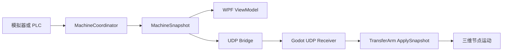

# WPF 启动、嵌入并同步 Godot

## 学习目标

完成两层串联：WPF 页面中显示 Godot 窗口，以及 WPF 将流程/坐标状态发送给 Godot。仅嵌入窗口不等于数据同步。

## 1. 总体关系



当前工程已经具备：

- WPF 自动定位并启动 Godot；
- 将 Godot 原生窗口嵌入 WPF `WindowsFormsHost`；
- WPF 通过 UDP 向 `127.0.0.1:46000` 发送 JSON 流程快照。

当前 Godot 工程尚未包含 UDP 接收脚本。要实现由 WPF 状态驱动动画，需要按第 5～7 节补上接收和映射。

## 2. WPF 项目结构

```text
DigitalTwinA4WZ2.Hmi              WPF、XAML、MVVM
DigitalTwinA4WZ2.Domain           状态和业务模型
DigitalTwinA4WZ2.Application      四工位协调器和接口
DigitalTwinA4WZ2.Simulator        无 PLC 模拟器
DigitalTwinA4WZ2.DigitalTwinBridge Godot 启动与 UDP 发送
DigitalTwinA4WZ2.Plc.Modbus       未来 PLC 通信
```

WPF 使用 `.NET 10`，Godot 项目仍可使用 `.NET 8`；它们是两个独立进程，通过 JSON 通信，不要求目标框架相同。

## 3. 在 WPF 页面预留 Godot 容器

项目通过 WinForms 面板取得原生 HWND：

```xml
<wfi:WindowsFormsHost x:Name="GodotWindowsFormsHost">
    <wf:Panel x:Name="GodotHostPanel" BackColor="#050A12"/>
</wfi:WindowsFormsHost>
```

XAML 需要命名空间：

```xml
xmlns:wfi="clr-namespace:System.Windows.Forms.Integration;assembly=WindowsFormsIntegration"
xmlns:wf="clr-namespace:System.Windows.Forms;assembly=System.Windows.Forms"
```

## 4. 启动并嵌入 Godot

`GodotEmbeddedHost` 的职责：

1. 向上查找包含 `project.godot` 的目录。
2. 从配置、`GODOT_EXECUTABLE` 或开始菜单定位 Godot Mono。
3. 使用 `--path <项目目录>` 启动 Godot。
4. 等待 `Process.MainWindowHandle` 有效。
5. 使用 Win32 `SetParent` 把 Godot 窗口设为面板子窗口。
6. 使用 `MoveWindow` 在 WPF 尺寸变化时铺满面板。
7. 关闭 WPF 时终止由它启动的 Godot 子进程。

WPF 首次选择数字孪生页时启动：

```csharp
private async void MainTabControl_OnSelectionChanged(
    object sender,
    SelectionChangedEventArgs e)
{
    if (!ReferenceEquals(MainTabControl.SelectedItem, DigitalTwinTab) ||
        _godotHost.IsRunning)
        return;

    await _godotHost.StartAsync();
}
```

## 5. WPF 发送状态快照

当前 `UdpDigitalTwinBridge` 把 `MachineSnapshot` 序列化为 UTF-8 JSON：

```csharp
public async Task PublishAsync(
    MachineSnapshot snapshot,
    CancellationToken cancellationToken)
{
    byte[] payload = JsonSerializer.SerializeToUtf8Bytes(snapshot);
    await _client.SendAsync(payload, _endpoint, cancellationToken);
}
```

发送入口是 `MainViewModel.OnSnapshotChanged()`：WPF 更新工位卡片后，将同一份不可变快照发送给 Godot，保证界面和三维画面使用相同状态源。

## 6. 为精确运动扩展数据合同

当前 `MachineSnapshot` 主要包含流程状态和工位进度。要让三维模型和设备坐标一致，应增加运动反馈：

```csharp
public sealed record TwinMotionSnapshot(
    long Sequence,
    DateTimeOffset Timestamp,
    double LiftPosition,
    double ArmAngleDegrees,
    double LoadingTurntableAngleDegrees,
    bool[] GrippersClosed,
    bool[] WorkpiecesAttached,
    double LeftDetectorPosition,
    double RightDetectorPosition,
    double SpindleSpeedRpm,
    bool CommunicationHealthy);
```

模拟模式由模拟器生成这些值；真实模式由 PLC 实际位置、编码器和到位反馈生成。不要让 WPF 根据动画时间猜真实位置。

## 7. Godot 接收 UDP

新建 `TwinUdpReceiver.cs`，挂到主场景根节点。下面代码在 Godot 主线程轮询本机 UDP，因此可以安全更新节点：

```csharp
using Godot;
using System;
using System.Text;
using System.Text.Json;

public partial class TwinUdpReceiver : Node
{
    [Export] public TransferArm TransferArm { get; set; }
    [Export] public int Port { get; set; } = 46000;

    private readonly PacketPeerUdp _udp = new();

    public override void _Ready()
    {
        Error error = _udp.Bind(Port, "127.0.0.1");
        if (error != Error.Ok)
            GD.PushError($"UDP 端口 {Port} 监听失败：{error}");
    }

    public override void _Process(double delta)
    {
        while (_udp.GetAvailablePacketCount() > 0)
        {
            byte[] packet = _udp.GetPacket();
            string json = Encoding.UTF8.GetString(packet);
            TwinMotionSnapshot? snapshot =
                JsonSerializer.Deserialize<TwinMotionSnapshot>(json);

            if (snapshot != null)
                TransferArm.ApplySnapshot(snapshot);
        }
    }

    public override void _ExitTree() => _udp.Close();
}
```

Godot 端需要定义与 JSON 字段一致的 `TwinMotionSnapshot`。推荐增加 `SchemaVersion`，以后新增字段时可兼容旧版本。

## 8. 将快照映射到节点

在 `TransferArm` 增加真实同步入口：

```csharp
public void ApplySnapshot(TwinMotionSnapshot snapshot)
{
    LiftPart.Position = new Vector3(
        LiftPart.Position.X,
        (float)snapshot.LiftPosition,
        LiftPart.Position.Z);

    RotatePart.RotationDegrees = new Vector3(
        (float)snapshot.ArmAngleDegrees,
        0,
        0);

    ApplyGripperFeedback(snapshot.GrippersClosed);
    ApplyWorkpieceFeedback(snapshot.WorkpiecesAttached);
}
```

实际项目应通过标定系数转换 PLC 单位：

```text
Godot位置 = Godot原点 + 方向系数 × PLC毫米值 × 模型缩放系数
Godot角度 = 角度零点偏移 + 方向系数 × PLC实际角度
```

## 9. 平滑显示且不超前

PLC/UDP 更新可能只有 20～50 Hz，而 Godot 以约 60 FPS 渲染。推荐保存最近两帧，在约 100 ms 的显示延迟下做插值；不要预测超过最新 PLC 反馈的位置。

若 300 ms 没有新数据，冻结动画并显示“数据延迟”；超过配置阈值则显示通信中断。具体时间根据 PLC 扫描周期调整。

## 10. 无 PLC 联调

1. WPF 使用 `SimulatedStationExecutor`。
2. 点击“启动单周期”。
3. `MachineCoordinator` 产生快照。
4. WPF 页面更新，并通过 UDP 发送。
5. Godot 接收后应用到节点。
6. 使用正常、无料、测量失败、钻孔失败、PLC 断线和测速丢失场景验证异常处理。

## 11. 有 PLC 后替换

只新增 `PlcStationExecutor` 和设备坐标映射：

```text
IStationExecutor
├─ SimulatedStationExecutor   现在教学使用
└─ PlcStationExecutor         以后真实设备使用
```

WPF、流程协调器、状态快照和 Godot 映射层保持不变。

下一章：[整体验收与故障排查](07-acceptance-troubleshooting.md)。
