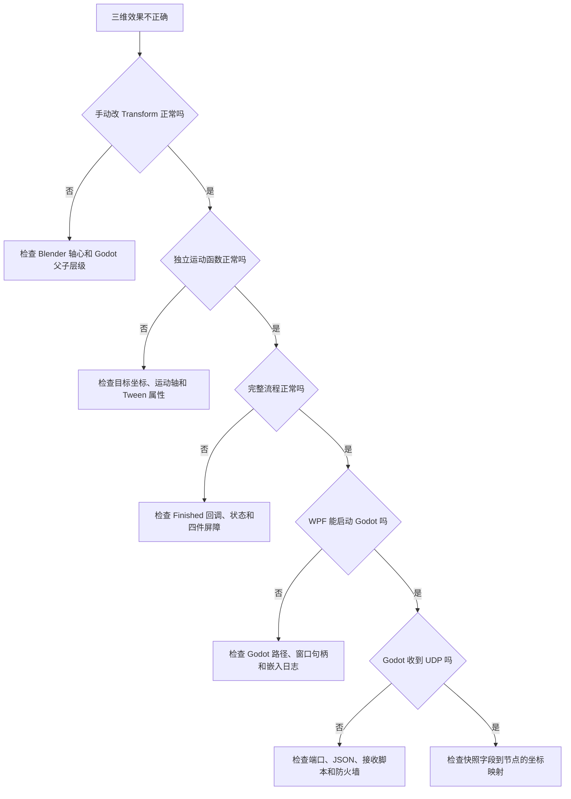

# 整体验收与故障排查

## 学习目标

按层验证整个数字孪生，快速判断问题属于 Blender、Godot 结构、坐标、运动函数、流程还是 WPF 通信。

## 1. 分层验收

| 层级 | 验收动作 | 通过标准 |
|---|---|---|
| Blender | 单独旋转/平移运动件 | 轴心、比例和方向正确 |
| Godot 结构 | 手动修改 Transform | 只带动机械上应跟随的零件 |
| 坐标 | 原点到工作位再复位 | 无跳动、无累积偏差 |
| 单动作 | 分别执行升降、旋转、夹具、检测 | 每个函数可独立完成 |
| 搬运 | 四件同时夹取与放置 | 不出现部分挂接 |
| 四工位 | 各工位不同完成时间 | 全部完成后只转位一次 |
| WPF 嵌入 | 打开数字孪生页 | Godot 正常铺满容器 |
| 状态同步 | WPF 改变模拟状态 | Godot 收到并更新对应节点 |
| 异常 | 断开 UDP/模拟 PLC 故障 | 动画冻结并提示，不继续猜测 |

## 2. 排错路径

## 3. Blender / 模型问题

- 旋转偏心：Origin 或外层枢轴位置错误。
- 零件大小差异巨大：单位不一致或未应用 Scale。
- 夹爪不能单独控制：模型未分件。
- 导入材质丢失：优先用 GLB 并检查纹理路径。

## 4. Godot 结构问题

- 升降时底座也动：固定件错误地放在升降节点下面。
- 转臂旋转时转子不跟随：转子尚未挂到 `WorkpieceMount`。
- 一个夹爪带动其他夹爪：夹爪父子关系错误。
- 碰撞检测不到：Area3D 层、遮罩、监控或 CollisionShape 未配置。

## 5. 坐标和函数问题

- 方向相反：目标值符号或模型局部轴相反。
- 复位失败：未保存原始 Position，或使用累加偏移。
- 动作同时发生：没有在 Tween `Finished` 中启动下一步。
- 动画卡住：下一步回调未绑定，或节点引用为空。

## 6. WPF 嵌入问题

- 找不到 Godot：设置 `GODOT_EXECUTABLE` 为 Godot Mono 可执行文件绝对路径。
- 等待窗口超时：先单独用 Godot 打开项目，排除脚本编译和模型导入错误。
- 窗口尺寸不跟随：确认宿主 Panel Resize 事件调用 `MoveWindow`。
- 关闭 WPF 后残留进程：确认窗口关闭流程调用 `GodotEmbeddedHost.DisposeAsync()`。

## 7. UDP 同步问题

- 发送成功但无动画：Godot 是否挂载 `TwinUdpReceiver`，端口是否同为 `46000`。
- JSON 反序列化为空：检查字段名称、枚举表示和 SchemaVersion。
- 动画跳跃：坐标单位或方向系数错误；不要直接把 PLC 毫米当成模型单位。
- 动画继续但通信已断：增加时间戳、序号和数据超时冻结。

## 8. 建议的演示脚本

1. 展示 Blender 中旋转轴心和夹爪分件。
2. 展示 Godot 节点树与父子跟随。
3. 打印原点和工作位坐标。
4. 单独执行升降、旋转和夹具函数。
5. 执行四件完整搬运。
6. 启动 WPF，打开数字孪生页。
7. 启动模拟周期，展示 WPF 与 Godot 同步。
8. 模拟通信断开，展示冻结和报警。

## 9. 最终交付检查

- [ ] Blender 运动件和固定件分离。
- [ ] 所有旋转轴心正确。
- [ ] Godot 节点层级表达真实机械约束。
- [ ] 坐标标定表已保存。
- [ ] 每个运动函数可独立运行和复位。
- [ ] 四件满足全有或全无挂接原则。
- [ ] 四工位屏障不会提前转位。
- [ ] WPF 能启动、嵌入和关闭 Godot。
- [ ] Godot 能接收 WPF 状态快照。
- [ ] 数据过期时动画冻结并提示。
- [ ] 安全动作仍由 PLC / 安全回路负责。

完成全部检查后，才可以认为教学版本形成了完整、可解释、可扩展的数字孪生闭环。
