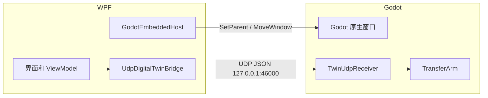

# WPF 与 Godot 连接逐步实现

> `A4WZ2` 分支当前主要保存 Godot 工程。以下内容是从零创建 WPF 连接层的教学步骤，不表示这些 WPF 文件已经存在于该分支。窗口嵌入和数据同步是两件不同的事，必须分别完成和验收。

## 学习目标

完成本章后，你将实现：

1. 使用 .NET 10 创建 WPF 上位机。
2. 在 WPF 页面中嵌入 Godot 原生窗口。
3. WPF 把整机状态序列化成 JSON，并通过 UDP 发送。
4. Godot 监听 UDP，根据状态只触发一次搬运流程。
5. 为以后 PLC 实际位置同步预留连续运动快照。

## 1. 先理解两个独立连接



- 窗口连接：解决“在哪里显示”。
- 数据连接：解决“显示什么动作”。

只完成窗口嵌入时，WPF 能看到 Godot，但 WPF 状态变化不会控制动画。

## 2. 创建 .NET 10 WPF 项目

在 Visual Studio 中：

1. 新建“WPF 应用”。
2. 项目名使用 `DigitalTwinA4WZ2.Hmi`。
3. 目标框架选择 `.NET 10.0`。
4. 在项目属性中启用 Windows Forms。

项目文件关键内容：

```xml
<Project Sdk="Microsoft.NET.Sdk">
  <PropertyGroup>
    <OutputType>WinExe</OutputType>
    <TargetFramework>net10.0-windows</TargetFramework>
    <UseWPF>true</UseWPF>
    <UseWindowsForms>true</UseWindowsForms>
    <Nullable>enable</Nullable>
    <ImplicitUsings>enable</ImplicitUsings>
  </PropertyGroup>
</Project>
```

逐项说明：

- `net10.0-windows`：允许使用 Windows 专有桌面 API。
- `UseWPF`：启用 WPF/XAML 编译。
- `UseWindowsForms`：让 WPF 可以使用 `WindowsFormsHost` 和 WinForms `Panel`。
- `Nullable`：帮助编译器发现未绑定节点、空进程等问题。

Godot 项目可以继续使用自身支持的 .NET 版本。两个程序是独立进程，通过 JSON 通信，不要求目标框架相同。

## 3. 在 WPF 页面准备 Godot 容器

在 `MainWindow.xaml` 根元素增加命名空间：

```xml
xmlns:wfi="clr-namespace:System.Windows.Forms.Integration;assembly=WindowsFormsIntegration"
xmlns:wf="clr-namespace:System.Windows.Forms;assembly=System.Windows.Forms"
```

在数字孪生页放置容器：

```xml
<Grid>
    <Grid.RowDefinitions>
        <RowDefinition Height="Auto"/>
        <RowDefinition Height="*"/>
    </Grid.RowDefinitions>

    <TextBlock x:Name="DigitalTwinStatusText"
               Text="数字孪生尚未启动"
               Margin="8"/>

    <wfi:WindowsFormsHost Grid.Row="1"
                         x:Name="GodotWindowsFormsHost">
        <wf:Panel x:Name="GodotHostPanel"
                  BackColor="#050A12"/>
    </wfi:WindowsFormsHost>
</Grid>
```

`WindowsFormsHost` 是 WPF 和 Win32 子窗口之间的桥。内部 `Panel` 能提供原生窗口句柄 `Handle`，Godot 窗口将成为这个句柄的子窗口。

## 4. 启动 Godot 进程

新建 `GodotEmbeddedHost.cs`。先定义需要保存的对象：

```csharp
using System.Diagnostics;
using System.Runtime.InteropServices;
using System.Windows.Forms;

public sealed class GodotEmbeddedHost : IAsyncDisposable
{
    private readonly Panel _hostPanel;
    private Process? _process;

    public GodotEmbeddedHost(Panel hostPanel)
    {
        _hostPanel = hostPanel;
        _hostPanel.Resize += OnHostPanelResize;
    }

    public bool IsRunning => _process is { HasExited: false };
    public event EventHandler<string>? StatusChanged;
}
```

字段说明：

- `_hostPanel`：WPF 页面中的承载面板。
- `_process`：由 WPF 启动的 Godot 进程。
- `IsRunning`：防止重复启动多个 Godot。
- `StatusChanged`：把“启动中、成功、失败”等信息显示到 WPF。

启动函数：

```csharp
public async Task StartAsync(
    string godotExecutable,
    string godotProjectDirectory,
    CancellationToken cancellationToken = default)
{
    if (IsRunning)
    {
        ResizeEmbeddedWindow();
        return;
    }

    ProcessStartInfo startInfo = new()
    {
        FileName = godotExecutable,
        WorkingDirectory = godotProjectDirectory,
        UseShellExecute = false
    };
    startInfo.ArgumentList.Add("--path");
    startInfo.ArgumentList.Add(godotProjectDirectory);

    StatusChanged?.Invoke(this, "正在启动 Godot……");
    _process = Process.Start(startInfo)
        ?? throw new InvalidOperationException("Godot 进程启动失败。");

    IntPtr windowHandle = await WaitForMainWindowAsync(
        _process,
        TimeSpan.FromSeconds(45),
        cancellationToken);

    EmbedWindow(windowHandle);
    StatusChanged?.Invoke(this, "Godot 数字孪生已加载");
}
```

为什么使用 `ArgumentList`：它会正确处理项目路径中的空格，不需要手工拼接引号。

## 5. 等待 Godot 主窗口

模型导入和 C# 编译需要时间，进程刚启动时 `MainWindowHandle` 可能是零：

```csharp
private static async Task<IntPtr> WaitForMainWindowAsync(
    Process process,
    TimeSpan timeout,
    CancellationToken cancellationToken)
{
    Stopwatch stopwatch = Stopwatch.StartNew();
    while (stopwatch.Elapsed < timeout)
    {
        cancellationToken.ThrowIfCancellationRequested();

        if (process.HasExited)
        {
            throw new InvalidOperationException(
                $"Godot 已退出，代码：{process.ExitCode}");
        }

        process.Refresh();
        if (process.MainWindowHandle != IntPtr.Zero)
            return process.MainWindowHandle;

        await Task.Delay(100, cancellationToken);
    }

    throw new TimeoutException("等待 Godot 主窗口超时。");
}
```

函数不是固定等待 45 秒，而是在 45 秒内每 100 ms 检查一次。有窗口立即返回；提前退出或超时都会产生明确异常。

## 6. 把 Godot 设为 WPF 子窗口

```csharp
[DllImport("user32.dll", SetLastError = true)]
private static extern IntPtr SetParent(
    IntPtr childWindow,
    IntPtr newParentWindow);

[DllImport("user32.dll", SetLastError = true)]
[return: MarshalAs(UnmanagedType.Bool)]
private static extern bool MoveWindow(
    IntPtr windowHandle,
    int x,
    int y,
    int width,
    int height,
    [MarshalAs(UnmanagedType.Bool)] bool repaint);

private void EmbedWindow(IntPtr windowHandle)
{
    Marshal.SetLastPInvokeError(0);
    SetParent(windowHandle, _hostPanel.Handle);
    int error = Marshal.GetLastWin32Error();
    if (error != 0)
        throw new InvalidOperationException($"嵌入失败，Win32 错误：{error}");

    ResizeEmbeddedWindow();
}
```

- `SetParent` 改变窗口父子关系。
- `_hostPanel.Handle` 是新的父窗口句柄。
- `MoveWindow` 不负责建立父子关系，只负责位置和大小。

调整尺寸：

```csharp
private void OnHostPanelResize(object? sender, EventArgs e) =>
    ResizeEmbeddedWindow();

private void ResizeEmbeddedWindow()
{
    if (_process is not { HasExited: false } process) return;

    process.Refresh();
    IntPtr handle = process.MainWindowHandle;
    if (handle == IntPtr.Zero) return;

    MoveWindow(
        handle,
        0,
        0,
        Math.Max(1, _hostPanel.ClientSize.Width),
        Math.Max(1, _hostPanel.ClientSize.Height),
        true);
}
```

生产版可以继续用 `GetWindowLongPtr/SetWindowLongPtr` 去除 Godot 标题栏和调整子窗口样式；初学演示先验证嵌入关系和缩放即可。

## 7. WPF 关闭时释放 Godot

```csharp
public async ValueTask DisposeAsync()
{
    _hostPanel.Resize -= OnHostPanelResize;

    if (_process is { HasExited: false } process)
    {
        process.CloseMainWindow();
        using CancellationTokenSource timeout =
            new(TimeSpan.FromSeconds(2));
        try
        {
            await process.WaitForExitAsync(timeout.Token);
        }
        catch (OperationCanceledException)
        {
            process.Kill(entireProcessTree: true);
            await process.WaitForExitAsync();
        }
    }

    _process?.Dispose();
    _process = null;
}
```

先请求正常关闭，2 秒后仍未退出才结束进程树。否则多次打开 WPF 后会留下多个 Godot 后台进程。

## 8. 定义 WPF 到 Godot 的状态合同

第一阶段只发送流程状态：

```csharp
public enum MachineState
{
    Initializing = 0,
    Idle = 1,
    Preparing = 2,
    RunningStations = 3,
    Transferring = 4,
    Stopping = 5,
    Faulted = 6,
    EmergencyStopped = 7
}

public sealed record MachineSnapshot(
    int SchemaVersion,
    long Sequence,
    long CycleId,
    DateTimeOffset Timestamp,
    MachineState MachineState,
    string Message);
```

字段说明：

| 字段 | 用途 |
|---|---|
| `SchemaVersion` | 以后扩展 JSON 时识别版本 |
| `Sequence` | 判断丢包、乱序和重复包 |
| `CycleId` | 防止同一生产周期重复启动动画 |
| `Timestamp` | 判断数据是否过期 |
| `MachineState` | 决定当前动画阶段 |
| `Message` | 日志和界面提示 |

枚举最好显式写数值，避免以后插入新成员导致旧 Godot 把状态解释成另一个动作。

## 9. 编写 WPF UDP 发送端

```csharp
using System.Net;
using System.Net.Sockets;
using System.Text.Json;

public sealed class UdpDigitalTwinBridge : IAsyncDisposable
{
    private readonly UdpClient _client = new();
    private readonly IPEndPoint _endpoint;

    public UdpDigitalTwinBridge(int port = 46000)
    {
        _endpoint = new IPEndPoint(IPAddress.Loopback, port);
    }

    public async Task PublishAsync<TSnapshot>(
        TSnapshot snapshot,
        CancellationToken cancellationToken)
    {
        byte[] payload = JsonSerializer.SerializeToUtf8Bytes(snapshot);
        await _client.SendAsync(payload, _endpoint, cancellationToken);
    }

    public ValueTask DisposeAsync()
    {
        _client.Dispose();
        return ValueTask.CompletedTask;
    }
}
```

为什么第一阶段选择 UDP：状态会持续刷新，偶尔丢失一帧时下一帧会覆盖旧值，不需要等待重传。UDP 不提供送达确认，所以危险控制命令仍必须通过 PLC 的命令确认机制，不能依赖这一通道。

## 10. 在 ViewModel 状态变化时发送

```csharp
private readonly UdpDigitalTwinBridge _digitalTwinBridge = new(46000);

private async void OnSnapshotChanged(
    object? sender,
    MachineSnapshot snapshot)
{
    CurrentState = snapshot.MachineState;
    StatusMessage = snapshot.Message;

    try
    {
        await _digitalTwinBridge.PublishAsync(
            snapshot,
            CancellationToken.None);
    }
    catch (Exception exception)
    {
        AddLog($"Godot 状态发送失败：{exception.Message}");
    }
}
```

同一份 `snapshot` 同时用于 WPF 数据绑定和 Godot，避免界面显示“正在转位”，三维画面却使用另一套本地计时器。

真实项目不建议长期使用 `async void`。事件处理器可以使用它，但内部必须捕获异常；普通业务函数应返回 `Task`。

## 11. Godot 接收 JSON

在 Godot 项目新建 `TwinUdpReceiver.cs`：

```csharp
using Godot;
using System;
using System.Text;
using System.Text.Json;

public sealed class TwinMachineSnapshot
{
    public int SchemaVersion { get; set; }
    public long Sequence { get; set; }
    public long CycleId { get; set; }
    public DateTimeOffset Timestamp { get; set; }
    public int MachineState { get; set; }
    public string Message { get; set; } = string.Empty;
}

public partial class TwinUdpReceiver : Node
{
    [Export] public TransferArm TransferArm { get; set; }
    [Export] public int Port { get; set; } = 46000;

    private readonly PacketPeerUdp _udp = new();
    private long _lastSequence = -1;
    private long _lastTransferCycle = -1;

    public override void _Ready()
    {
        if (TransferArm == null)
        {
            GD.PushError("TwinUdpReceiver 没有绑定 TransferArm。");
            SetProcess(false);
            return;
        }

        Error error = _udp.Bind(Port, "127.0.0.1");
        if (error != Error.Ok)
        {
            GD.PushError($"UDP {Port} 监听失败：{error}");
            SetProcess(false);
        }
    }

    public override void _Process(double delta)
    {
        while (_udp.GetAvailablePacketCount() > 0)
        {
            byte[] packet = _udp.GetPacket();
            ApplyJson(Encoding.UTF8.GetString(packet));
        }
    }

    private void ApplyJson(string json)
    {
        try
        {
            TwinMachineSnapshot? snapshot =
                JsonSerializer.Deserialize<TwinMachineSnapshot>(json);

            if (snapshot == null || snapshot.SchemaVersion != 1)
                return;

            if (DateTimeOffset.UtcNow - snapshot.Timestamp >
                TimeSpan.FromSeconds(2))
                return;

            if (snapshot.Sequence <= _lastSequence)
                return;

            _lastSequence = snapshot.Sequence;

            bool shouldTransfer =
                snapshot.MachineState == 4 &&
                snapshot.CycleId != _lastTransferCycle;

            if (shouldTransfer && TransferArm.IsIdle())
            {
                _lastTransferCycle = snapshot.CycleId;
                TransferArm.StartTransferCycle();
            }

            if (snapshot.MachineState is 6 or 7)
                TransferArm.EmergencyStop();
        }
        catch (JsonException exception)
        {
            GD.PushWarning($"数字孪生 JSON 错误：{exception.Message}");
        }
    }

    public override void _ExitTree() => _udp.Close();
}
```

关键保护：

- 版本不认识时不执行。
- 序号小于等于上一帧时丢弃，防止乱序和重复。
- 同一个 `CycleId` 只触发一次转位。
- `TransferArm.IsIdle()` 为假时不覆盖正在运行的 Tween。
- 故障或急停状态停止动画。

如果允许 WPF 重启但保持独立 Godot 不退出，应在合同中再增加 `SourceInstanceId`。Godot 发现新的来源实例后重置 `_lastSequence`，否则新 WPF 从零开始的序号会被当成旧包。

在场景根节点下添加 `Node`，挂载脚本，并在 Inspector 中绑定 `TransferArm`。

## 12. 从“触发动画”升级为“实际位置同步”

上面的接收器只在状态进入 `Transferring` 时播放预设动画。真实 PLC 接入后，应发送反馈位置：

```csharp
public sealed record TwinMotionSnapshot(
    int SchemaVersion,
    long Sequence,
    DateTimeOffset Timestamp,
    double LiftMillimeters,
    double ArmAngleDegrees,
    bool[] GrippersClosed,
    bool[] WorkpiecesAttached,
    double LeftDetectorMillimeters,
    double RightDetectorMillimeters,
    bool CommunicationHealthy);
```

Godot 不再根据固定 `LiftDuration` 猜测位置，而是使用 PLC/编码器反馈：

```csharp
public void ApplyMotionSnapshot(TwinMotionSnapshot snapshot)
{
    float liftY = HomePosition.Y +
                  (float)(snapshot.LiftMillimeters * LiftScale * LiftDirection);

    LiftPart.Position = new Vector3(
        LiftPart.Position.X,
        liftY,
        LiftPart.Position.Z);

    RotatePart.RotationDegrees = new Vector3(
        (float)snapshot.ArmAngleDegrees,
        0,
        0);
}
```

`TransferArm` 中同时导出标定参数：

```csharp
[Export] public float LiftScale { get; set; } = 1f;
[Export] public float LiftDirection { get; set; } = -1f;
```

Godot 端还要定义字段名称相同的 `TwinMotionSnapshot` DTO；它与 WPF 类型不需要位于同一个程序集，只需要 JSON 属性名称和单位一致。

转换参数：

```text
Godot坐标 = Godot原点 + PLC毫米值 × 模型比例 × 方向系数
Godot角度 = 零点偏移 + PLC角度 × 方向系数
```

`LiftScale` 解决模型单位和毫米不一致；`LiftDirection` 通常为 `1` 或 `-1`；零点偏移解决编码器零点与模型零角不同。

## 13. 通信频率和超时

建议初始参数：

| 项目 | 教学值 | 说明 |
|---|---|---|
| WPF→Godot 状态发送 | 状态变化时立即发送 | 适合事件动画 |
| 连续位置发送 | 20～50 Hz | 兼顾流畅度和负载 |
| Godot 渲染 | 约 60 FPS | 两帧反馈之间可插值 |
| 数据延迟提示 | 300 ms | 显示“数据延迟”并冻结预测 |
| 通信中断 | 1000～2000 ms | 进入断线显示，具体按现场节拍确认 |

不要让 Godot 预测超过最新 PLC 反馈的位置。动画可以稍有延迟，但不能表现为机器已经到位而实际尚未到位。

## 14. 分层验收

1. 单独启动 Godot，确认机械动画正常。
2. 单独启动 WPF，确认页面和数据绑定正常。
3. WPF 嵌入 Godot，只验证窗口显示和缩放。
4. 用固定 JSON 测试 UDP，不运行生产流程。
5. WPF 进入 `Transferring`，确认 Godot只触发一次。
6. 连续发送位置，确认坐标方向和比例。
7. 停止发送，确认 Godot 显示数据延迟并冻结。
8. 发送故障/急停状态，确认动画停止。

下一章：[PLC 数据绑定、点表与异常处理](10-plc-data-binding.md)。
